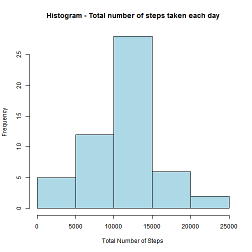
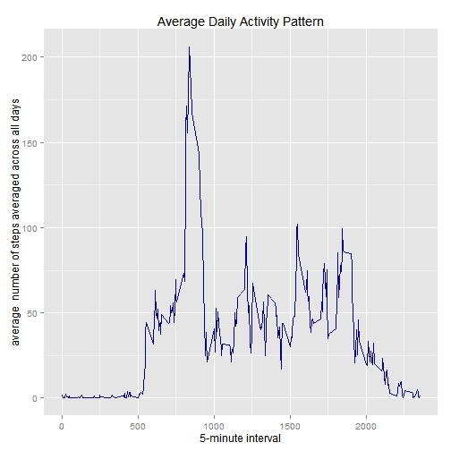
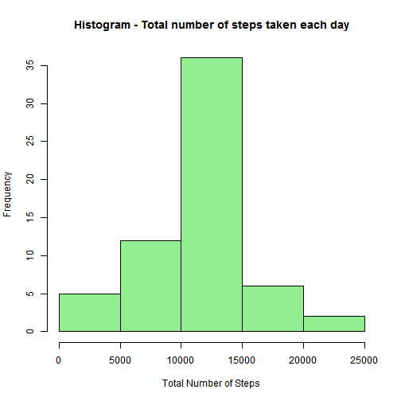
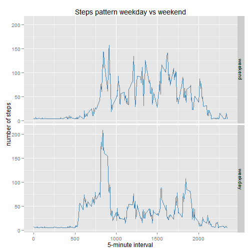

## Load required packages  


```r
library(ggplot2)
```
Loaded **ggplot2** package to implement exploratory graphs during the assigment  
  

## Load and preprocess the data  


```r
ActivityMonitoringData<-read.csv(file = "activity.csv",header = TRUE)
ActivityMonitoringDataWithoutNAs <- ActivityMonitoringData[!is.na(ActivityMonitoringData$steps),]
```
Loaded **Activity.csv** file and removed **NAs** from the resulting data frame to begin analysis  
  
  
## Frequency of total number of steps taken per day  


```r
histdata<-aggregate(ActivityMonitoringDataWithoutNAs$steps,by=list(ActivityMonitoringDataWithoutNAs$date),FUN=sum)
```
Aggregated the activity data to compute total number of steps taken each day to create the following histogram  

```r
hist(x=histdata$x,xlab = "Total Number of Steps",ylab = "Frequency",main = "Histogram - Total number of steps taken each day",col = "lightblue")
```

 
  
  

## Mean and median total number of steps taken per day  


```r
reportmean<-mean(histdata$x)
reportmedian<-median(histdata$x)
```

**Calculated mean as 1.0766189 &times; 10<sup>4</sup> and median as 10765**   
  
  
## Average daily activity pattern  

Created timeseries plot for average daily activity to understand the pattern  


```r
timeseriesdata<-aggregate(ActivityMonitoringData$steps,by=list(ActivityMonitoringData$interval),FUN=mean,na.rm=TRUE)
colnames(timeseriesdata)<-c("interval","mean")
ggplot(timeseriesdata,aes(x = interval ,y=mean)) + xlab("5-minute interval") + ylab("average  number of steps averaged across all days") +geom_line(col="darkblue") +ggtitle("Average Daily Activity Pattern")
```

 

```r
maxsteps<-timeseriesdata[which.max(timeseriesdata$mean),]$interval
```

**On an average maximum number of steps are taken during 835 interval**  
  
  
## Input missing values  

```r
CountNA<-sum(is.na(ActivityMonitoringData$steps))
```
**Number of missing step values in activity data are 2304, which may bias the results. So substituting missing values with the mean of steps across the data set**   

```r
ActivityMonitoringData_NewSet<-ActivityMonitoringData
ActivityMonitoringData_NewSet[is.na(ActivityMonitoringData_NewSet$steps),]$steps<-mean(ActivityMonitoringData$steps,na.rm = TRUE)
```
  
  

## Check impact of inputting missing values  


```r
histdata_NewSet<-aggregate(ActivityMonitoringData_NewSet$steps,by=list(ActivityMonitoringData_NewSet$date),FUN=sum)
hist(x=histdata_NewSet$x,xlab = "Total Number of Steps",ylab = "Frequency",main = "Histogram - Total number of steps taken each day",col = "lightgreen")
```

 

```r
reportmean_NewSet<-mean(histdata_NewSet$x)
reportmediann_NewSet<-median(histdata_NewSet$x)
meandiff<-reportmean_NewSet - reportmean
mediandiff<-reportmediann_NewSet - reportmedian
```

**Calculated new mean as 1.0766189 &times; 10<sup>4</sup> and new median as 1.0766189 &times; 10<sup>4</sup> after substituting missing values**  

**The difference in mean total number of steps taken per day is 0**   
**The difference in median total number of steps taken per day is 1.1886792**  
**In addition, the histograms look different too**    
  
## Differences in activity patterns between weekdays and weekends  

Created panel plot to identify patterns between weekdays and weekends  

```r
ActivityMonitoringData_NewSet$weekdayorweekend<-as.factor(ifelse(weekdays(as.Date(as.character(ActivityMonitoringData_NewSet$date),"%Y-%m-%d")) %in% c('Sunday','Saturday'),"weekend","weekday"))
ActivityMonitoringData_NewSet$weekdayorweekend<-factor(ActivityMonitoringData_NewSet$weekdayorweekend,levels = c("weekend","weekday"))
ActivityMonitoringData_NewSet_timeseriesdata<-aggregate(ActivityMonitoringData_NewSet$steps,by = list(ActivityMonitoringData_NewSet$interval,ActivityMonitoringData_NewSet$weekdayorweekend),FUN=mean)
colnames(ActivityMonitoringData_NewSet_timeseriesdata)<-c("interval","weekdayorweekend","steps")
ggplot(ActivityMonitoringData_NewSet_timeseriesdata,aes(x=interval,y=steps)) + xlab("5-minute interval") + ylab("number of steps") +geom_line(col="steelblue") +ggtitle("Steps pattern weekday vs weekend") + facet_grid(weekdayorweekend~.)
```

 

**The above timeseries graphs demonstrate difference in activity patterns between weekdays and weekends**    
